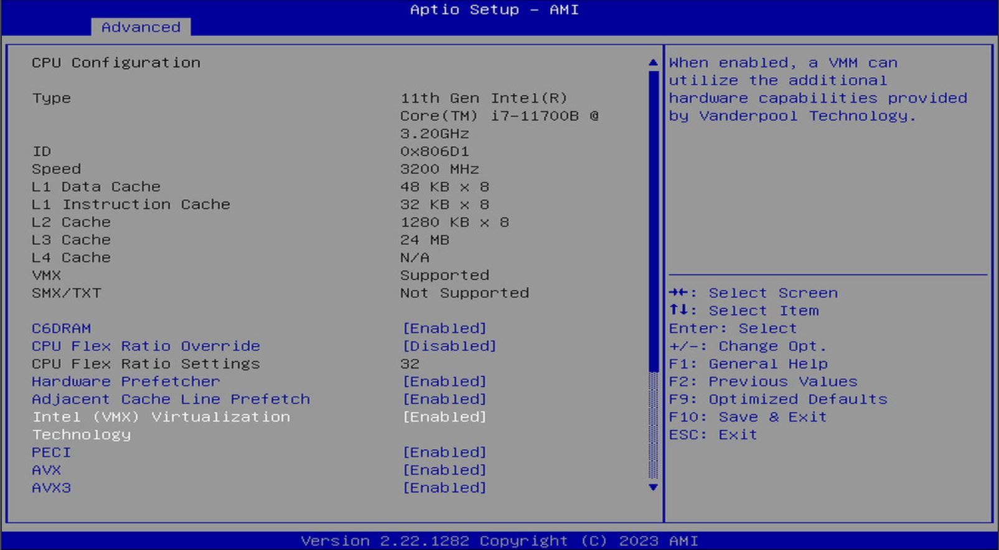
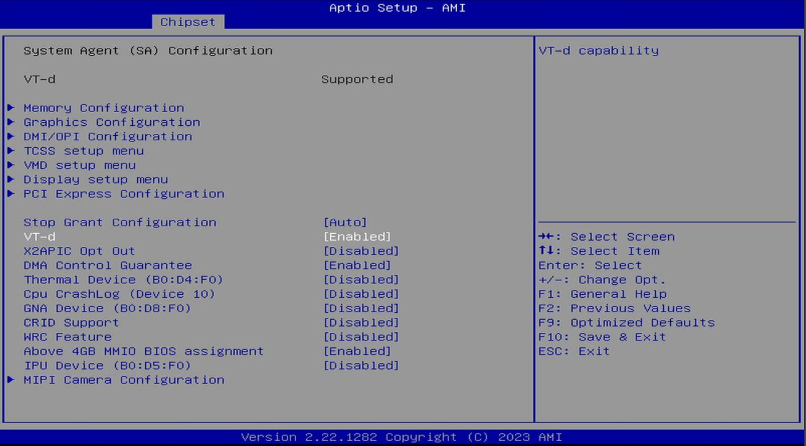

I could only find this information in passing on a [Craft Computing PCIe Passthrough video](https://youtu.be/_hOBAGKLQkI?t=390). Shoutout!

In short:

`Advanced -> CPU Configuration -> Intel (VMX) Virtualization Technology -> Enabled`

`Chipset -> System Agent (SA) Configuration -> VT-d -> Enabled`

